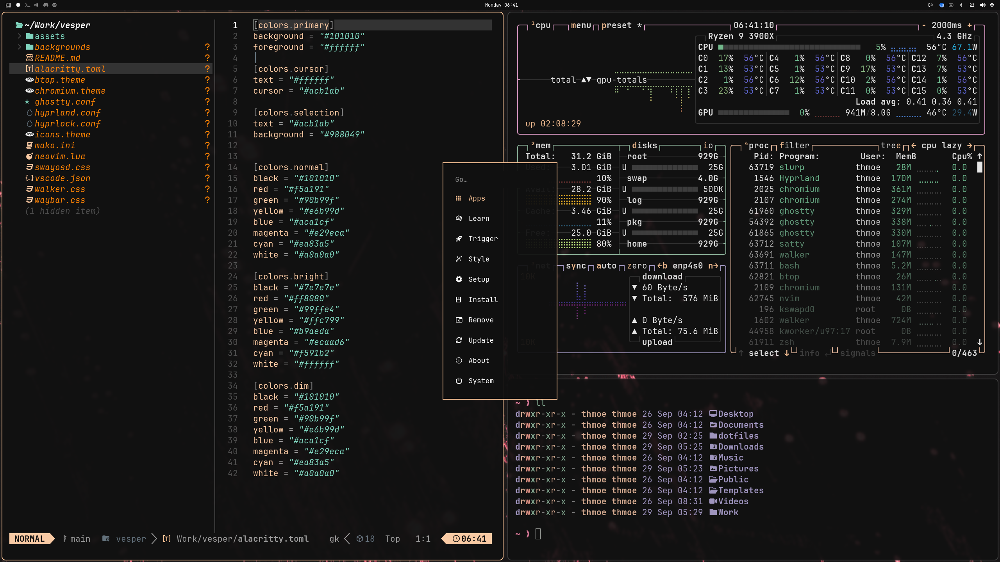

# Vesper

This theme is inspired by the [VS Code Vesper Theme](https://github.com/raunofreiberg/vesper).

## Screenshot



## Installation

To install this theme, just simply use:

```bash
omarchy-theme-install https://github.com/thmoee/omarchy-vesper-theme
```

Or use the Omarchy Menu via `Super + Alt + Space` and select `Install > Style > Theme` to enter the GitHub URL of this Repository.
